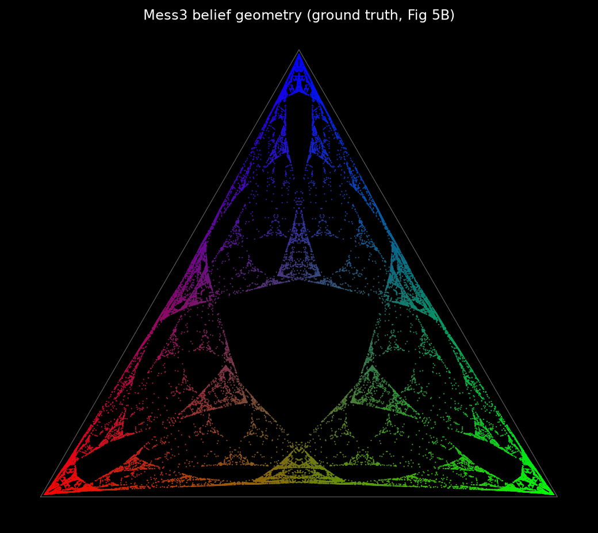
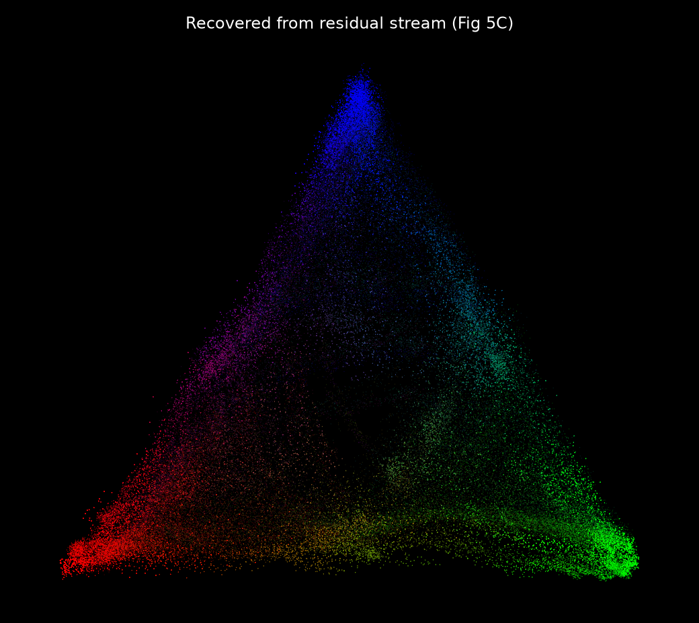
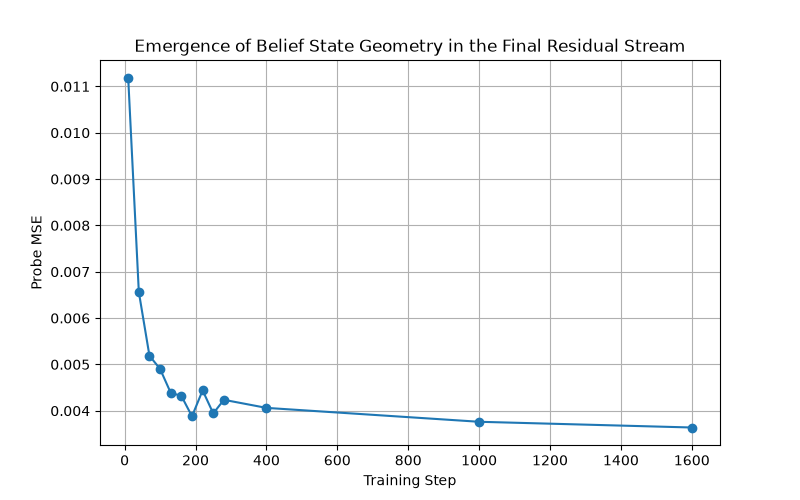

# Recreating "Transformers Represent Belief State Geometry in their Residual Stream"

A from-scratch reimplementation of the core results of Shai et al. (NeurIPS 2024),
[arXiv:2405.15943](https://arxiv.org/abs/2405.15943).

The paper's claim: a transformer trained only on next-token prediction over a hidden
Markov process linearly represents, in its residual stream, the **belief states** an
optimal predictor must track — a (often fractal) geometry in the probability simplex.
This repo reproduces that on the Mess3 process: it recovers the belief-state fractal
from a trained model's activations (Fig 5), and shows the geometry **emerges** over
training (Fig 6).

## Results

Ground-truth belief geometry (computed from the HMM) vs. recovered from the trained
model's residual stream via a linear probe:

| Ground truth (Fig 5B) | Recovered from residual stream (Fig 5C) |
|---|---|
|  |  |

The geometry emerging as the model learns to predict (Fig 6): probe error drops
sharply in the first ~100 steps, then slowly sharpens.



## Setup (macOS, zsh)

```bash
python3 -m venv .venv
source .venv/bin/activate
pip install --upgrade pip
pip install -r requirements.txt
```

Run everything on **CPU** if using a MacOS device. Apparently, the PyTorch + MPS combination can produce silently
incorrect activations, which would corrupt the probe (the loss may still look fine).
All scripts take `--device cpu`. To check what your machine has:

```bash
python -c "import torch; print('mps available:', torch.backends.mps.is_available())"
```

I have not gotten there yet, but I assume CUDA should work fine on compatible machines.
If needed, I'll make the necessary code change.

## Pipeline

```bash
# 1. ground-truth geometry, no model needed (writes mess3_msp.png, rrxor_msp.png)
python plot_msp.py

# 2. train a transformer on Mess3 (writes checkpoints/)
python train.py --process mess3 --steps 2000 --device cpu

# 3. recover the fractal from the residual stream (writes recovered_mess3.png)
python probe.py --ckpt checkpoints/mess3_final.pt --device cpu

# 4. emergence-over-training curve (writes emergence_curve.png)
python emergence.py --device cpu
```

## Files

| file            | what it does                                                          | status |
|-----------------|----------------------------------------------------------------------|--------|
| `processes.py`  | HMM definitions (Mess3, RRXOR), sampling, stationary distribution     | done   |
| `msp.py`        | belief update, belief-for-sequence, belief cloud / distinct states    | done   |
| `plot_msp.py`   | ground-truth belief geometries (Fig 5B, Fig 7B)                       | done   |
| `model.py`      | TransformerLens model spec; names the residual-stream hook            | done   |
| `train.py`      | train on a process; dense-early/coarse-late checkpoints; loss vs floor| done   |
| `probe.py`      | collect activations, fit affine probe, recover geometry (Fig 5C)      | done   |
| `emergence.py`  | probe over checkpoints, plot probe-MSE vs training step (Fig 6)       | done   |

## Progress

- [x] Data-generating processes (Mess3, RRXOR)
- [x] Belief-state geometry / MSP (ground truth)
- [x] Train transformer on Mess3 to the optimal-prediction floor
- [x] Linear probe recovers the Mess3 fractal from the residual stream (Fig 5C)
- [x] Emergence of the geometry over training (Fig 6)
- [ ] RRXOR: across-layer probe + "beyond next-token" distance analysis (Fig 7)

## Notes / known limitations

- My recovered fractal shows the three corners and coarse structure crisply; the
  finest nested sub-triangles are fuzzier than the paper's, which is a function of
  training length (the fine detail keeps sharpening well past the loss floor). A
  longer run sharpens it further.
- A few transformer hyperparameters (layer/head/MLP sizes, optimizer) were
  reconstructed and flagged in `model.py`; `d_model=64`, context 10, and the probe
  target (final-block `resid_post`) are confirmed against the paper.

## Reference

Shai, Marzen, Riechers, et al., "Transformers Represent Belief State Geometry in
their Residual Stream," NeurIPS 2024. arXiv:2405.15943.